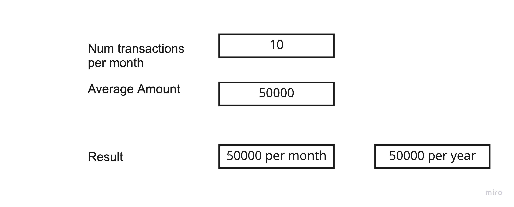

# Payment fee calculator
Coding challenge for a fictional payment fee calculator. 

## Task

At payactive we want to give our customers the possibility to calculate their payments fees. 

Product manager Matthias briefly defines the requirements: 

> *Matthias*: The customer should be able to enter two things. Firstly the number of expected monthly transactions. Secondly the average transaction amount. When they click on a button, they should see the monthly and yearly fees. 

Based on Matthias' input, our designer Manuel came up with a design for this. 

> *Manuel*: Let me see ... how about this?

> *Matthias*: Looks great :) Now, let me define how the fee is calculated. 
> 1) The standard fee is 1,4 % of the amount.
> 2) The min transaction fee is 0,35 €
> 3) The max transaction fee is 2,00 €
> 4) Additionally, for high amounts there is an additional fee of 0,1 %. The high amount barrier is 5000 €. Only 
> 4) Additionally, for high amounts there is a "High Amount Fee" of 
