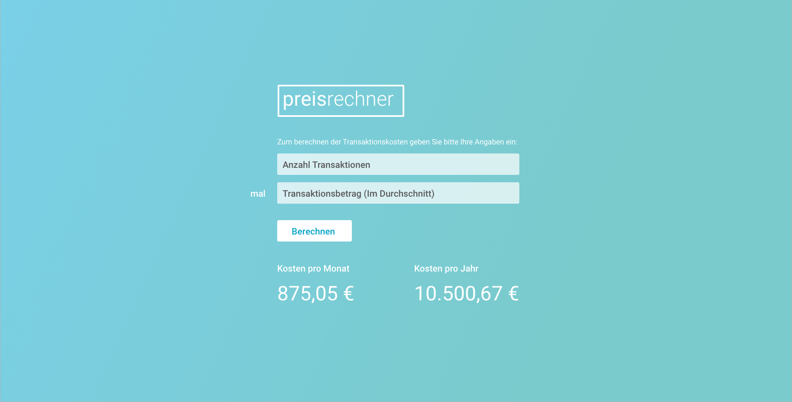

# Payment fee calculator
Coding challenge for a fictional payment fee calculator. 

## Task

At payactive we want to give our customers the possibility to calculate their payments fees. 

Product manager Mathias briefly defines the requirements: 

> *Mathias*: The customer should be able to enter two things. Firstly the number of expected monthly transactions. Secondly the average transaction amount. When they click on a button, they should see the monthly and yearly fees. 

Based on Mathias' input, our designer Manuel came up with a design for this. 

> *Manuel*: Let me see ... how about this?

> *Mathias*: Looks great :) Now, let me define how the fee is calculated. 
> 1) The standard fee is 1,4 % of the amount.
> 2) The min transaction fee is 0,35 €
> 3) The max transaction fee is 2,00 €
> 4) Additionally, for high amounts there is an additional fee of 0,1 %. The treshold that defines "high amount" is 5000 €. It is important that only the value above the treshold is relevant for this additional fee. 

> *Manuel*: Ok, sounds logical. Can you give some examples so I can visualise it better?

> *Mathias*: Sure thing. If you take an amount of 120 € then the fee is 1,68 €. For 210 € it is 2 €, because you reached the cap. If you take 8000 € then you ready the high amount area and the fee is 5 €. Makes sense? 

> *Manuel*: Absolutely, can't wait to see it in action :) 

## Your turn

Please help Mathias and Manuel to bring this feature to life. 

1. Please do not use more than 2-3 hours of your time. If you do not finish, no problem. Let us talk about the challenges. 
2. The result does not need to look exactly like the Mockup, it should just give an idea.
2. You can use any framework you like (at payactive we work with React). 
3. Please make full use of online documention, or even discuss it with a friend. For us it is important how you approach this task. 
4. Most importantly, have fun!